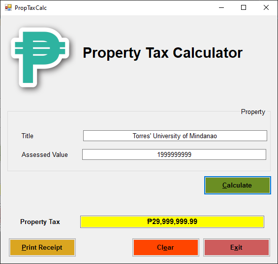

# Week 2: Let's Analyze (Activity 1b)

<p align="center">
  
</p>

\* | Name |
--- | ---
Project | **prjPropertyTax_Luchavez**
App | **Property Tax Calculator**

## Events

### ...when user clicks *Calculate* button
```
Private Sub btnCalculate_Click(sender As Object, e As EventArgs) Handles btnCalculate.Click
        Dim propValue As Decimal = Val(txtPropValue.Text)
        Dim propTax As Decimal = propValue * 0.015
        txtPropTax.Text = FormatCurrency(propTax, 2)
End Sub
```

### ...when user clicks *Print Receipt* button
```
Private Sub btnPrint_Click(sender As Object, e As EventArgs) Handles btnPrint.Click
        btnCalculate.Hide()
        btnPrint.Hide()
        btnClear.Hide()
        btnExit.Hide()
        printMain.Print()
        btnCalculate.Show()
        btnPrint.Show()
        btnClear.Show()
        btnExit.Show()
End Sub
```

### ...when user clicks *Clear* button
```
Private Sub btnClear_Click(sender As Object, e As EventArgs) Handles btnClear.Click
        txtPropName.Clear()
        txtPropValue.Clear()
        txtPropTax.Clear()
        txtPropValue.Focus()
End Sub
```

### ...when user clicks *Exit* button
```
Private Sub btnExit_Click(sender As Object, e As EventArgs) Handles btnExit.Click
        Me.Close()
End Sub
```